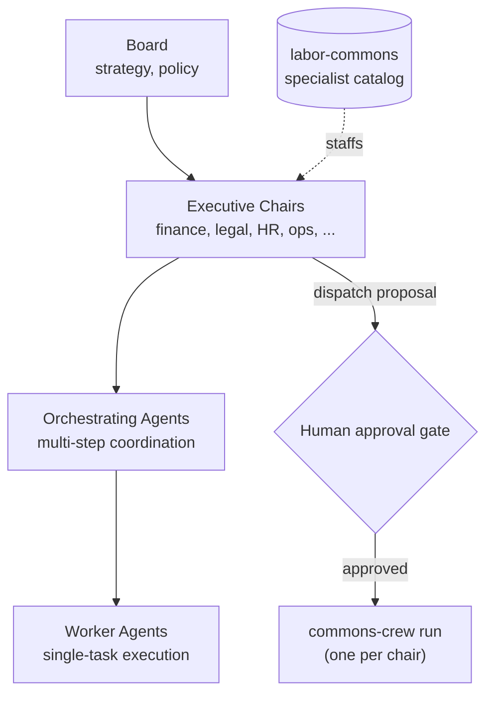

# commons-board

commons-board runs a business or a worker collective end to end with AI
agents under human oversight. A board sets strategy; executive chairs own a
function (finance, legal, HR, marketing, operations, product); orchestrating
agents coordinate multi-step work across chairs; worker agents execute
individual tasks. Every chair is staffed by a real domain specialist from
[labor-commons](https://github.com/Open-Labor-Foundation/labor-commons) —
not a generic AI persona — and every action above your chosen autonomy
level waits for a human to approve it before anything real happens.

## Architecture



Every chair is a real [commons-crew](https://github.com/Open-Labor-Foundation/commons-crew)
instance under the hood — commons-board is governance (the board, the
approval gate, autonomy tiers) wrapped around commons-crew, not a separate
implementation. Deeper wiring detail lives in
[docs/IMPLEMENTATION-NOTES.md](docs/IMPLEMENTATION-NOTES.md).

Three autonomy levels control how much of that chain runs without a human,
from every action requiring approval (**Advisor**, the default for new
deployments) through routine-auto/novel-escalates (**Orchestrator**) to
policy-bounded autonomous execution (**Autopilot**).

## Quickstart

```bash
cp .env.example .env
docker compose up
```

- Web UI: http://127.0.0.1:3100
- API: http://127.0.0.1:4000 (health check at `/health`)

Ships bound to localhost with header-based auth for a single trusted
operator by default, and runs with mock connectors out of the box — no
inference provider key required to explore the UI. Configure a real
provider key through the Settings UI when you're ready. Read
`.env.example` before exposing this beyond your own machine.

## Status

The core is built and verified: the governed hierarchy, the approval gate,
and chair-to-commons-crew dispatch have all been exercised end to end
against real running servers (propose → explicit approve → real delegated
execution, and propose → explicit deny → no execution). What's not built
is a deployment path for a non-technical operator — Docker and a terminal
are the only way in today, and most of the small business owners and
worker collectives this is ultimately for won't run a container by hand.
A no-terminal (desktop/mobile) deployment is the near-term gap, not the
governance model itself.

## Two modes, one engine

| Mode | Authority | Economics |
|---|---|---|
| Business | owner / founding team | bill your own customers — subscriptions, per-seat, invoicing |
| Collective | membership, by vote/consensus | pooled treasury, governed distribution |

The mode changes who approves what. The hierarchy, the catalog, and the
autonomy controls are shared.

## Addins

Addins are both developed and installed here, and published to
[commons-artifacts](https://github.com/Open-Labor-Foundation/commons-artifacts)
for other boards to install. Publishing one back from inside a running
board (no git required) is planned, not built yet — today that step is
manual.

## Repo layout

| Path | What's there |
|---|---|
| `apps/web` | Next.js UI |
| `services/api` | orchestration engine, REST API |
| `services/testing-agent` | end-to-end scenario runner |
| `packages/shared`, `packages/connectors` | shared types, inference-provider connectors |

`npm run dev` / `build` / `test` / `lint` / `migrate` run across all
workspaces.

## Further reading

- [planning/concept.md](planning/concept.md) and [planning/execution-plan.md](planning/execution-plan.md) — full design and phased plan
- [docs/IMPLEMENTATION-NOTES.md](docs/IMPLEMENTATION-NOTES.md) — how specific pieces are wired
- [open-labor-foundation/ARCHITECTURE.md](https://github.com/Open-Labor-Foundation/open-labor-foundation/blob/main/ARCHITECTURE.md) — the full ecosystem picture
- [labor-commons](https://github.com/Open-Labor-Foundation/labor-commons) — the specialist catalog · [commons-keeper](https://github.com/Open-Labor-Foundation/commons-keeper) — keeps it current · [commons-crew](https://github.com/Open-Labor-Foundation/commons-crew) — personal-assistant alternative front end · [commons-idea](https://github.com/Open-Labor-Foundation/commons-idea) — build something, then bring it here to govern at org scale

## License

AGPL-3.0.
