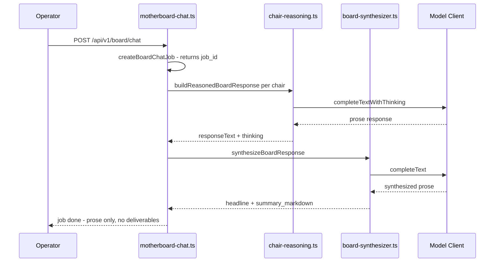
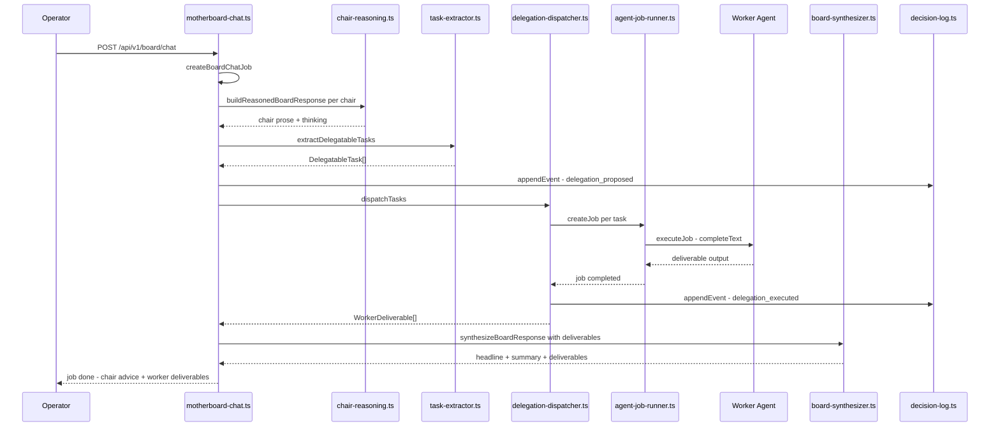
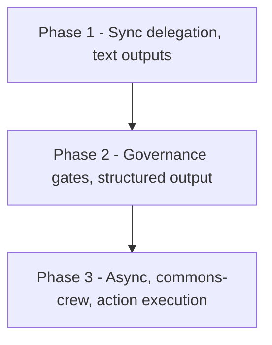

# commons-board — Delegation Architecture

## Problem Statement

The board chat flow currently breaks at the chair level. When an operator sends a message to the board, [`executeBoardChat()`](commons-board/services/api/src/routes/motherboard-chat.ts:55) calls [`buildReasonedBoardResponse()`](commons-board/services/api/src/services/chair-reasoning.ts:143), which makes an LLM call and returns prose. That prose flows to [`synthesizeBoardResponse()`](commons-board/services/api/src/services/board-synthesizer.ts:33) and back to the operator. No worker is ever invoked, no job is ever created, no deliverable is ever produced.

The pieces for delegation exist but are disconnected:

- **CB-native job runner** ([`agent-job-runner.ts`](commons-board/services/api/src/services/agent-job-runner.ts:1)) — polls every 5s, executes via [`completeText()`](commons-board/services/api/src/lib/model-client.ts:96), but only produces prose. Reachable only via the manual `POST /api/v1/workers/:agentId/task` endpoint in [`workers.ts`](commons-board/services/api/src/routes/workers.ts:236), never from the chat flow.
- **Commons-crew delegation** ([`commons-crew-client.ts`](commons-board/services/api/src/lib/commons-crew-client.ts:143)) — `proposeDispatchToChair()` requires manual proposal + approval + `CB_COMMONS_CREW_URL`. Reachable only via `POST /api/v1/board/requests/:id/dispatch-to-commons-crew` in [`motherboard.ts`](commons-board/services/api/src/routes/motherboard.ts:334), never from the chat flow.
- **Child runtime client** ([`child-runtime-client.ts`](commons-board/services/api/src/services/child-runtime-client.ts:1)) — dead code, zero callers.
- **Reasoning loop** ([`reasoning-loop.ts`](commons-board/services/api/src/services/reasoning-loop.ts:79)) — stub returning hardcoded strings, no execution.
- **Execution engine** ([`engine.ts`](commons-board/services/api/src/agent-runtime/execution/engine.ts:316)) — produces governance decisions, not deliverables.

The operator's expectation: give instructions to chairs, chairs delegate to workers, workers complete individual tasks, combined results = task completion. Workers should produce deliverables (documents, code, real-world work products). This has never happened.

## Design Goal

Wire the existing job runner into the board chat flow so that chairs delegate actionable tasks to their worker agents, workers produce deliverables, and those deliverables aggregate back into the response the operator sees. Extend existing systems — do not replace them.

## Current Flow (Broken)



## Target Flow (Fixed)



## Section A — Task Extraction

### Problem

[`buildReasonedBoardResponse()`](commons-board/services/api/src/services/chair-reasoning.ts:143) returns a `ChairReasoningResult` containing `responseText` (prose) and `thinking`. There is no structured representation of what work the chair thinks should be delegated. The synthesizer receives prose and produces more prose. Workers never receive a task.

### Design

Introduce a new module [`task-extractor.ts`](commons-board/services/api/src/services/task-extractor.ts) that takes a chair's prose response and the board request context, then returns zero or more `DelegatableTask` objects via a structured LLM call.

#### Type: `DelegatableTask`

```typescript
export type OutputType =
  | "document"
  | "analysis"
  | "checklist"
  | "structured_data"
  | "code"
  | "real_world_action";

export interface DelegatableTask {
  task_id: string;              // UUID, generated by extractor
  description: string;          // What the worker should produce
  assigned_worker_id: string;   // agent_id from chair.worker_agents[]
  expected_output_type: OutputType;
  expected_output_description: string;  // What "done" looks like
  context: string;              // Relevant excerpt from chair reasoning + request
  depends_on: string[];         // task_ids this task waits on (empty = parallel)
  source_chair_id: string;      // Which chair proposed this task
  source_excerpt: string;       // Quote from chair response that motivated it
}
```

#### Function: `extractDelegatableTasks`

```typescript
export async function extractDelegatableTasks(input: {
  chairId: string;
  chairResponse: string;        // responseText from ChairReasoningResult
  chairThinking: string;        // thinking from ChairReasoningResult
  workerAgents: BlueprintWorkerAgent[];  // from chair.worker_agents
  requestContext: string;       // summary of BoardRequestRecord
  domain: BoardDomain;
}): Promise<DelegatableTask[]>
```

The function calls [`completeText()`](commons-board/services/api/src/lib/model-client.ts:96) with a system prompt that:

1. Presents the chair's response and thinking.
2. Lists the available worker agents with their `name`, `labor_commons_ref`, and `task_scope`.
3. Asks the LLM to identify actionable tasks that match a worker's `task_scope`.
4. Returns strict JSON: `{ "tasks": DelegatableTask[] }`.

The LLM is instructed to only assign tasks to workers whose `task_scope` includes the task type. If no worker matches, the task is not extracted (it stays as chair advice in the synthesis).

#### Fallback behavior

If the LLM call fails or returns invalid JSON, `extractDelegatableTasks` returns an empty array. The chat flow continues with prose-only synthesis — identical to current behavior. Task extraction never blocks the existing flow.

#### Where it is called

In [`executeBoardChat()`](commons-board/services/api/src/routes/motherboard-chat.ts:55), after each chair's `buildReasonedBoardResponse()` completes (line 244), call `extractDelegatableTasks()` with that chair's result. Collect all tasks across all chairs into a single `DelegatableTask[]` before proceeding to dispatch.

## Section B — Worker Dispatch

### Problem

The existing job runner in [`agent-job-runner.ts`](commons-board/services/api/src/services/agent-job-runner.ts:1) has `executeJob()` (line 113) and `startJobRunner()` (line 213), but it polls every 5s for pending jobs. The only way to create a job is `POST /api/v1/workers/:agentId/task` in [`workers.ts`](commons-board/services/api/src/routes/workers.ts:236). The chat flow never calls `createJob()` from [`job-store.ts`](commons-board/services/api/src/lib/job-store.ts:61).

### Design

Introduce [`delegation-dispatcher.ts`](commons-board/services/api/src/services/delegation-dispatcher.ts) that bridges `DelegatableTask[]` to the existing job store and job runner.

#### Type: `WorkerDeliverable`

```typescript
export interface WorkerDeliverable {
  task_id: string;
  worker_agent_id: string;
  worker_name: string;
  output_type: OutputType;
  output: string;              // The deliverable content
  status: "completed" | "failed" | "skipped";
  error?: string;              // Present if status is "failed"
  source_chair_id: string;
  started_at: string;          // ISO timestamp
  completed_at: string;        // ISO timestamp
}
```

#### Function: `dispatchTasks`

```typescript
export async function dispatchTasks(input: {
  workspaceId: string;
  tasks: DelegatableTask[];
  blueprint: AgentBlueprint;
  timeoutMs: number;           // Per-task timeout, default 120000
}): Promise<WorkerDeliverable[]>
```

The function:

1. **Resolves dependencies**: Topologically sorts tasks by `depends_on`. Tasks with no dependencies run in parallel via [`mapConcurrent()`](commons-board/services/api/src/lib/model-client.ts:169). Tasks with dependencies wait for their predecessors to complete.

2. **Creates jobs**: For each task, calls [`createJob()`](commons-board/services/api/src/lib/job-store.ts:61) with:
   ```typescript
   {
     agent_id: task.assigned_worker_id,
     task: {
       description: task.description,
       expected_output: task.expected_output_description,
       priority: "normal",
       context: task.context,
     }
   }
   ```

3. **Executes inline (Phase 1)**: Rather than relying on the 5s poll loop, `dispatchTasks` calls a new exported `executeJobInline()` function from `agent-job-runner.ts` that runs `executeJob()` immediately and returns when done. This avoids the polling delay for chat-driven delegation. The poll loop remains for manually-created jobs.

4. **Collects results**: After each job completes, reads the job's `result` field from [`getJob()`](commons-board/services/api/src/lib/job-store.ts:88) and maps it to a `WorkerDeliverable`.

5. **Handles failures**: If a job fails or times out, the `WorkerDeliverable` has `status: "failed"` with the error message. Failed tasks do not block other independent tasks. Dependent tasks whose predecessor failed are marked `status: "skipped"`.

#### Changes to `agent-job-runner.ts`

- Export `executeJob()` (currently private) or wrap it in a new `executeJobInline(jobId: string): Promise<AgentJob>` function.
- The existing `startJobRunner()` poll loop continues unchanged for manual jobs.

#### Changes to `job-store.ts`

The existing `AgentJob` type already has `task.description`, `task.expected_output`, `task.priority`, `task.context`, and `result`. No schema change needed. The `result` field will contain the worker's deliverable output as a string.

## Section C — Result Aggregation

### Problem

[`synthesizeBoardResponse()`](commons-board/services/api/src/services/board-synthesizer.ts:33) currently receives `ChairConsultResult[]` (prose from each chair) and produces a `BoardSynthesisResult` with `headline` and `summary_markdown`. It has no concept of worker deliverables. The operator sees chair advice but never sees what workers produced.

### Design

Extend `synthesizeBoardResponse()` to accept an optional `deliverables: WorkerDeliverable[]` parameter and include them in both the LLM synthesis prompt and the structured output.

#### Extended input type

```typescript
export async function synthesizeBoardResponse(input: {
  chairResults: ChairConsultResult[];
  deliverables: WorkerDeliverable[];     // NEW — empty array = current behavior
  requestContext: string;
  domain: BoardDomain;
  operatorMessage: string;
}): Promise<BoardSynthesisResult>
```

#### Extended output type

```typescript
export type BoardSynthesisResult = {
  headline: string;
  summary_markdown: string;
  deliverables: DeliverableSummary[];    // NEW
};

export type DeliverableSummary = {
  task_id: string;
  worker_name: string;
  output_type: OutputType;
  status: "completed" | "failed" | "skipped";
  excerpt: string;                       // First N chars of output, or error message
  full_output_available: boolean;        // true if full output is stored in job store
};
```

#### Synthesis prompt changes

The system prompt for the synthesis LLM call is extended to include:

1. A **Deliverables** section listing each `WorkerDeliverable` with its `worker_name`, `output_type`, and `output` (truncated to a reasonable length per deliverable, e.g. 4000 chars).
2. Instruction to the LLM: "Incorporate worker deliverables into your summary. If a worker produced a document, reference it. If a worker failed, note the gap. The operator should understand what was actually produced vs. what was only advised."

#### Fallback behavior

If `deliverables` is an empty array, the synthesis prompt is identical to today — pure chair prose synthesis. No regression.

#### Where the operator sees results

The `BoardChatResult` in [`board-chat-job-store.ts`](commons-board/services/api/src/lib/board-chat-job-store.ts:17) is extended:

```typescript
export type BoardChatResult = {
  headline: string;
  summary_markdown: string;
  deliverables: DeliverableSummary[];    // NEW
  // existing fields remain
};
```

The `GET /api/v1/board/chat/jobs/:jobId` endpoint in [`motherboard-chat.ts`](commons-board/services/api/src/routes/motherboard-chat.ts:347) already returns the full `BoardChatJob` including `result`. The operator's UI reads this endpoint and will now see `deliverables` in the response. No new endpoint needed.

## Section D — Governance Gates

### Problem

The governance system exists — [`decision-log.ts`](commons-board/services/api/src/lib/decision-log.ts:34) provides `appendEvent()` with hash-chaining, and [`governance-signing.ts`](commons-board/services/api/src/lib/governance-signing.ts:111) provides `signPayload()`. The execution engine in [`engine.ts`](commons-board/services/api/src/agent-runtime/execution/engine.ts:287) has `governAction()` that applies autonomy tiers and financial policies. But none of this is wired into the chat flow. Delegation happens (or will happen) with no audit trail.

### Design

Insert two governance gates into the delegation flow, both using the existing `appendEvent()` mechanism.

#### Gate 1: Pre-dispatch (delegation_proposed)

Before `dispatchTasks()` creates any jobs, `executeBoardChat()` calls `appendEvent()` with a `delegation_proposed` event:

```typescript
{
  org_id: workspaceId,
  event_type: "delegation_proposed",
  actor: "system:board-chat",
  payload: {
    job_id: boardChatJobId,
    task_count: tasks.length,
    tasks: tasks.map(t => ({
      task_id: t.task_id,
      assigned_worker_id: t.assigned_worker_id,
      description: t.description,
      output_type: t.expected_output_type,
      source_chair_id: t.source_chair_id,
    })),
  },
  prev_hash: lastHash,
}
```

This records what was about to be delegated, to which workers, and on whose behalf (which chair). The hash chain ensures tamper-evidence.

#### Gate 2: Post-dispatch (delegation_executed)

After `dispatchTasks()` returns, `executeBoardChat()` calls `appendEvent()` with a `delegation_executed` event:

```typescript
{
  org_id: workspaceId,
  event_type: "delegation_executed",
  actor: "system:board-chat",
  payload: {
    job_id: boardChatJobId,
    deliverables: deliverables.map(d => ({
      task_id: d.task_id,
      worker_agent_id: d.worker_agent_id,
      status: d.status,
      output_length: d.output.length,
      error: d.error,
    })),
  },
  prev_hash: lastHash,
}
```

This records what actually happened — which tasks completed, which failed, output sizes. The operator can audit the full delegation lifecycle via the decision log.

#### Autonomy tier integration

The `AgentBlueprint` contains an `AutonomyPolicy` with `approval_required_for` — a list of action types that need human approval before execution. The delegation flow checks this:

1. Before dispatch, `dispatchTasks()` filters tasks by `output_type`. If a task's `output_type` is `"real_world_action"` and `"real_world_action"` is in the chair's `approval_required_for`, the task is held for approval rather than executed immediately.
2. Held tasks produce a `WorkerDeliverable` with `status: "skipped"` and `error: "Pending operator approval"`.
3. The synthesis includes a note: "N tasks held for operator approval — review in the approvals queue."
4. The operator can approve via the existing `POST /api/v1/approvals` endpoint, which triggers execution of the held task.

This mirrors the pattern in [`engine.ts`](commons-board/services/api/src/agent-runtime/execution/engine.ts:287) where `governAction()` checks autonomy tiers and produces `GovernedAction` with `approved: boolean`.

#### What is NOT added

- No new signing mechanism. The existing `signPayload()` / `verifySignedPayload()` is sufficient.
- No new database table. The decision log is append-only file-based storage.
- No changes to `governance-signing.ts`. The keyring and HMAC-SHA256 flow is reused as-is.

## Section E — Execution Modes

### Problem

Workers currently execute via a single path: [`executeJob()`](commons-board/services/api/src/services/agent-job-runner.ts:113) calls [`completeText()`](commons-board/services/api/src/lib/model-client.ts:96) and stores the result as prose. But the `OutputType` enum includes `"code"`, `"structured_data"`, and `"real_world_action"` — none of which are well-served by a single LLM text completion.

### Design

Define three execution modes, selected per-task based on `expected_output_type`. All three flow through the same `dispatchTasks()` interface; the difference is what happens inside `executeJob()`.

#### Mode 1: Text Generation (default)

**Applies to**: `"document"`, `"analysis"`, `"checklist"`

This is the current behavior. `executeJob()` calls `completeText()` with [`buildWorkerSystemPrompt()`](commons-board/services/api/src/services/agent-job-runner.ts:67) and stores the result. No change needed.

The worker system prompt (already built by `buildWorkerSystemPrompt()`) includes the worker's `labor_commons_ref` specialist spec, `task_scope`, and the job's `task.description` / `task.context` / `task.expected_output`. This is sufficient for document/analysis/checklist outputs.

#### Mode 2: Structured Output

**Applies to**: `"structured_data"`

`executeJob()` calls `completeText()` with a system prompt that instructs the LLM to return strict JSON matching a schema derived from `expected_output_description`. The result is validated as JSON before being stored. If validation fails, the job is retried once with a corrective prompt ("Your previous output was not valid JSON. Return only valid JSON matching this schema: ..."). If it fails again, the deliverable is marked `status: "failed"` with `error: "Invalid JSON output"`.

This does not require a new LLM call mechanism — `completeText()` already returns raw text. The validation is a post-processing step.

#### Mode 3: Action Execution

**Applies to**: `"code"`, `"real_world_action"`

This mode is gated by the autonomy tier (see Section D). For `"code"` outputs, the worker produces code as text (same as Mode 1) but the deliverable is tagged as code in the `WorkerDeliverable.output_type`, allowing the UI to render it with syntax highlighting. The code is not executed — it is a deliverable for the operator to review.

For `"real_world_action"`, the task is held for approval (Section D, Gate 1). After approval, `executeJob()` would call into the execution engine ([`runAgentExecution()`](commons-board/services/api/src/agent-runtime/execution/engine.ts:316)) to produce `GovernedAction[]` that are then executed. This is the most complex mode and is deferred to Phase 3 of the implementation plan.

#### Mode selection logic

```typescript
function executionModeFor(outputType: OutputType): "text" | "structured" | "action" {
  switch (outputType) {
    case "structured_data": return "structured";
    case "code":
    case "real_world_action": return "action";
    default: return "text";
  }
}
```

This function is called inside `executeJob()` (or `executeJobInline()`) to select the execution path. The existing `buildWorkerSystemPrompt()` is used for all modes; the mode only changes the output validation and post-processing.

## Section F — Async vs Sync

### Problem

The board chat flow is currently synchronous from the operator's perspective: `POST /api/v1/board/chat` creates a job, runs all chairs, synthesizes, and the operator polls `GET /api/v1/board/chat/jobs/:jobId` until `status: "completed"`. Adding worker delegation increases the total time — each worker makes an LLM call, and with 3-5 workers per chair across 5+ chairs, the total could be 30+ seconds.

### Design

Support both sync and async delegation. The mode is determined by a threshold on the number of tasks extracted.

#### Sync mode (default, few tasks)

If `tasks.length <= 5`, delegation runs synchronously within `executeBoardChat()`. The operator's existing poll loop works as-is — the job transitions from `running` to `completed` and includes deliverables in the result. Total latency = chair reasoning + task extraction + worker execution + synthesis.

This is the Phase 1 behavior. It is simple, testable, and works for the common case where a board message generates a handful of worker tasks.

#### Async mode (many tasks)

If `tasks.length > 5`, delegation runs asynchronously:

1. `executeBoardChat()` extracts tasks, logs the `delegation_proposed` event, creates all jobs via `createJob()`, then immediately calls `synthesizeBoardResponse()` with an empty `deliverables` array.
2. The `BoardChatResult` includes `summary_markdown` noting: "N worker tasks dispatched. Results will be appended as they complete."
3. The `BoardChatJob` status is set to `completed` with a new field `delegation_pending: true`.
4. The existing job runner poll loop ([`startJobRunner()`](commons-board/services/api/src/services/agent-job-runner.ts:213)) picks up the created jobs and executes them normally.
5. As each job completes, a callback updates the `BoardChatJob` — appends the `WorkerDeliverable` to `result.deliverables` and logs a `delegation_executed` event.
6. The operator polls `GET /api/v1/board/chat/jobs/:jobId` and sees deliverables accumulate. When all jobs are done, `delegation_pending` is set to `false`.

#### Changes to `BoardChatJob`

```typescript
export type BoardChatJob = {
  // existing fields...
  delegation_pending?: boolean;        // NEW — true while async delegation is running
  delegation_task_ids?: string[];      // NEW — job IDs created for this chat job
};
```

#### Changes to `agent-job-runner.ts`

The poll loop's `executeJob()` gets a post-completion hook: if the completed job was created by a board chat delegation (identified by a `source_board_chat_job_id` field on the job), it calls a new `onDelegationJobComplete()` callback that updates the `BoardChatJob`.

This requires adding `source_board_chat_job_id?: string` to the `AgentJob` type in [`job-store.ts`](commons-board/services/api/src/lib/job-store.ts:14).

#### Operator UX

The operator's polling already works. The only change is that `deliverables` may be partially populated on early polls and fully populated on later polls. The UI should show a "workers still executing..." indicator when `delegation_pending: true`.

## Section G — Integration with Existing Systems

### commons-crew bridge

The commons-crew delegation path ([`proposeDispatchToChair()`](commons-board/services/api/src/lib/commons-crew-client.ts:143) / [`submitDispatchDecision()`](commons-board/services/api/src/lib/commons-crew-client.ts:335)) remains a separate, manually-initiated flow. It is not replaced by CB-native delegation.

The relationship:

- **CB-native delegation** (this design): chairs → CB worker agents → `completeText()` → deliverables. Runs inside commons-board. No external dependency. This is the default path.
- **Commons-crew delegation** (existing): chairs → commons-crew run → external crew execution → results posted back. Requires `CB_COMMONS_CREW_URL` and manual proposal/approval. This is the "heavy" path for tasks that need a full crew runtime (e.g., multi-agent code execution in a sandboxed environment).

The `BoardRequestRecord` already has `auto_dispatch_to_commons_crew: boolean` and `commons_crew_dispatch: CommonsCrewDispatchState`. When `auto_dispatch_to_commons_crew` is true AND `CB_COMMONS_CREW_URL` is configured, `dispatchTasks()` can optionally route specific tasks to commons-crew instead of the CB-native runner. This is a Phase 3 enhancement — Phase 1 always uses CB-native.

### Labor-commons specialist specs

Worker agents are created during onboarding via [`buildChairRefsAndWorkers()`](commons-board/services/api/src/agent-runtime/interview/generate-artifacts.ts:412). Each worker's `labor_commons_ref` is a specialist slug. The specialist spec is loaded by [`getSpecialist()`](commons-board/services/api/src/lib/labor-commons-client.ts:434) and already used by [`buildWorkerSystemPrompt()`](commons-board/services/api/src/services/agent-job-runner.ts:67) to construct the worker's system prompt.

No change needed here. The specialist spec's `supported_tasks` drives task extraction (Section A — the extractor checks `task_scope` which is derived from `supported_tasks`). The spec's `out_of_scope_rules` should also be passed to the task extractor to prevent assigning tasks the specialist explicitly does not do.

### Execution engine

[`runAgentExecution()`](commons-board/services/api/src/agent-runtime/execution/engine.ts:316) produces `GovernedAction[]` with financial policy enforcement and autonomy tier checks. This is used for the `"real_world_action"` execution mode (Section E, Mode 3).

The integration point: when a `"real_world_action"` task is approved (Section D), `executeJob()` calls `runAgentExecution()` with an `ArtifactsForExecution` constructed from the blueprint and the task. The resulting `GovernedAction[]` are executed (or held for further approval if the governor denies them). The execution log from `ExecutionLogBook` is attached to the `WorkerDeliverable` as part of the `output` field.

This integration is Phase 3. Phase 1 does not touch the execution engine.

### Reasoning loop

[`reasoning-loop.ts`](commons-board/services/api/src/services/reasoning-loop.ts:79) is currently a stub. It defines `PlannerStep`, `CriticStep`, `ExecutorStep`, `MemoryStep` types — a plan/critique/execute/remember cycle. This design does not depend on the reasoning loop, but the task extraction step (Section A) is conceptually similar to the planner step.

Future enhancement: replace the single-pass `extractDelegatableTasks()` LLM call with a full reasoning loop — planner proposes tasks, critic validates them against worker `task_scope` and `out_of_scope_rules`, executor formats them, memory records what was delegated. This is out of scope for the initial implementation but the types are already defined.

### Child runtime client

[`child-runtime-client.ts`](commons-board/services/api/src/services/child-runtime-client.ts:1) is dead code with zero callers. It is not used by this design. It should be deleted as cleanup, but that is independent of this work.

### Board session state

[`board-session-state.ts`](commons-board/services/api/src/services/board-session-state.ts:1) manages active board context and session state. The delegation flow does not require changes to session state — delegation is scoped to a single `BoardChatJob` and does not persist across sessions. However, the `BoardActiveBoardContext` could be extended in the future to include "recent deliverables" for context in subsequent chats.

## Section H — Phased Implementation Plan

### Phase 1 — Sync delegation, text outputs only

**Goal**: Wire the job runner into the chat flow for the simplest case. Chairs delegate, workers produce text deliverables, operator sees them in the response.

**Files to create**:
- [`task-extractor.ts`](commons-board/services/api/src/services/task-extractor.ts) — `extractDelegatableTasks()`, `DelegatableTask`, `OutputType`
- [`delegation-dispatcher.ts`](commons-board/services/api/src/services/delegation-dispatcher.ts) — `dispatchTasks()`, `WorkerDeliverable`

**Files to modify**:
- [`motherboard-chat.ts`](commons-board/services/api/src/routes/motherboard-chat.ts:55) — After chair results (line 244), call `extractDelegatableTasks()` per chair, then `dispatchTasks()`, then pass deliverables to `synthesizeBoardResponse()`
- [`agent-job-runner.ts`](commons-board/services/api/src/services/agent-job-runner.ts:113) — Export `executeJobInline()` wrapping the private `executeJob()`
- [`board-synthesizer.ts`](commons-board/services/api/src/services/board-synthesizer.ts:33) — Accept `deliverables: WorkerDeliverable[]`, include in prompt and output
- [`board-chat-job-store.ts`](commons-board/services/api/src/lib/board-chat-job-store.ts:17) — Add `deliverables: DeliverableSummary[]` to `BoardChatResult`

**Verification**:
- Send a board chat message that should produce worker tasks (e.g., "Draft a Q3 budget memo and a compliance checklist")
- Confirm `GET /api/v1/board/chat/jobs/:jobId` response includes `deliverables` array with completed worker outputs
- Confirm decision log contains `delegation_proposed` and `delegation_executed` events
- Confirm existing prose-only flow still works when no tasks are extracted (e.g., "What do you think about our strategy?")

**Out of scope for Phase 1**: async mode, structured output validation, action execution, commons-crew routing, autonomy tier approval gates.

### Phase 2 — Governance gates + structured output

**Goal**: Add audit trail and structured data output support.

**Files to modify**:
- [`motherboard-chat.ts`](commons-board/services/api/src/routes/motherboard-chat.ts:55) — Insert `appendEvent()` calls before and after `dispatchTasks()`
- [`agent-job-runner.ts`](commons-board/services/api/src/services/agent-job-runner.ts:113) — Add JSON validation for `"structured_data"` output type with one retry
- [`delegation-dispatcher.ts`](commons-board/services/api/src/services/delegation-dispatcher.ts) — Add autonomy tier check: hold `"real_world_action"` tasks for approval

**Verification**:
- Confirm decision log events are hash-chained and verifiable via `verifyLog()`
- Send a chat message requesting structured data (e.g., "Generate a JSON risk matrix") and confirm the deliverable is valid JSON
- Send a chat message requesting a real-world action and confirm the task is held with `status: "skipped"` and the synthesis notes the approval requirement

### Phase 3 — Async mode + commons-crew routing + action execution

**Goal**: Handle large task volumes, route to commons-crew when configured, and execute approved real-world actions.

**Files to modify**:
- [`delegation-dispatcher.ts`](commons-board/services/api/src/services/delegation-dispatcher.ts) — Add sync/async threshold check, async path creates jobs and returns immediately
- [`agent-job-runner.ts`](commons-board/services/api/src/services/agent-job-runner.ts:213) — Add `onDelegationJobComplete()` callback in poll loop for async delegation
- [`job-store.ts`](commons-board/services/api/src/lib/job-store.ts:14) — Add `source_board_chat_job_id?: string` to `AgentJob`
- [`board-chat-job-store.ts`](commons-board/services/api/src/lib/board-chat-job-store.ts:25) — Add `delegation_pending?: boolean` and `delegation_task_ids?: string[]` to `BoardChatJob`
- [`delegation-dispatcher.ts`](commons-board/services/api/src/services/delegation-dispatcher.ts) — Add commons-crew routing when `auto_dispatch_to_commons_crew` is true and `CB_COMMONS_CREW_URL` is set
- [`agent-job-runner.ts`](commons-board/services/api/src/services/agent-job-runner.ts:113) — For approved `"real_world_action"` tasks, call `runAgentExecution()` and attach the execution log

**Verification**:
- Send a chat message that generates >5 tasks and confirm the response returns immediately with `delegation_pending: true`, then deliverables accumulate on subsequent polls
- With `CB_COMMONS_CREW_URL` set and `auto_dispatch_to_commons_crew: true`, confirm tasks route to commons-crew via `proposeDispatchToChair()`
- Approve a held `"real_world_action"` task via `POST /api/v1/approvals` and confirm `runAgentExecution()` produces `GovernedAction[]`

### Dependency graph



Phase 1 is independently shippable and delivers the core value: chairs delegate to workers, workers produce deliverables, operator sees them. Phases 2 and 3 add safety and scale.