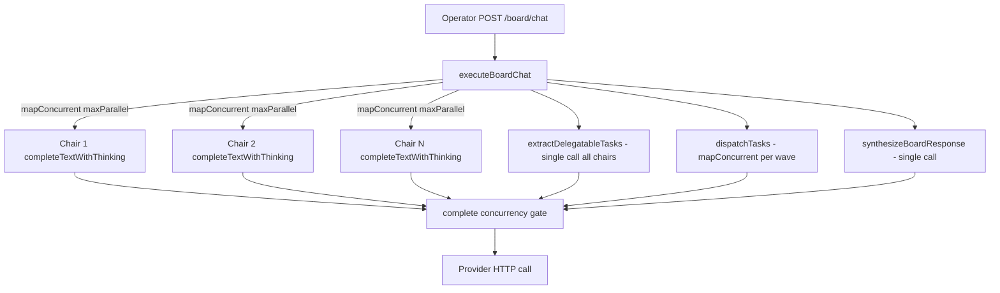
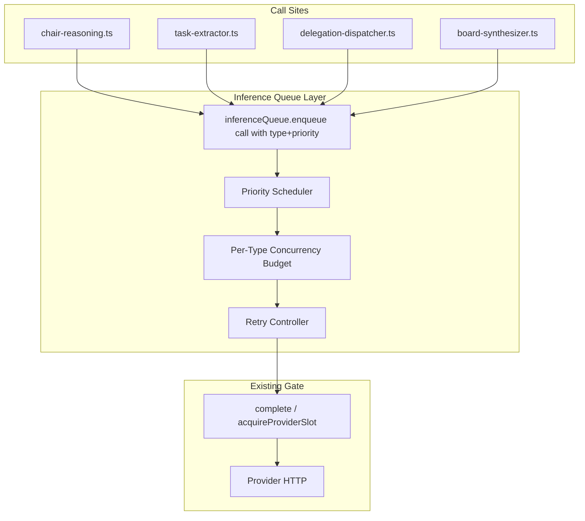
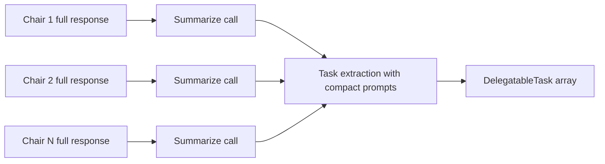
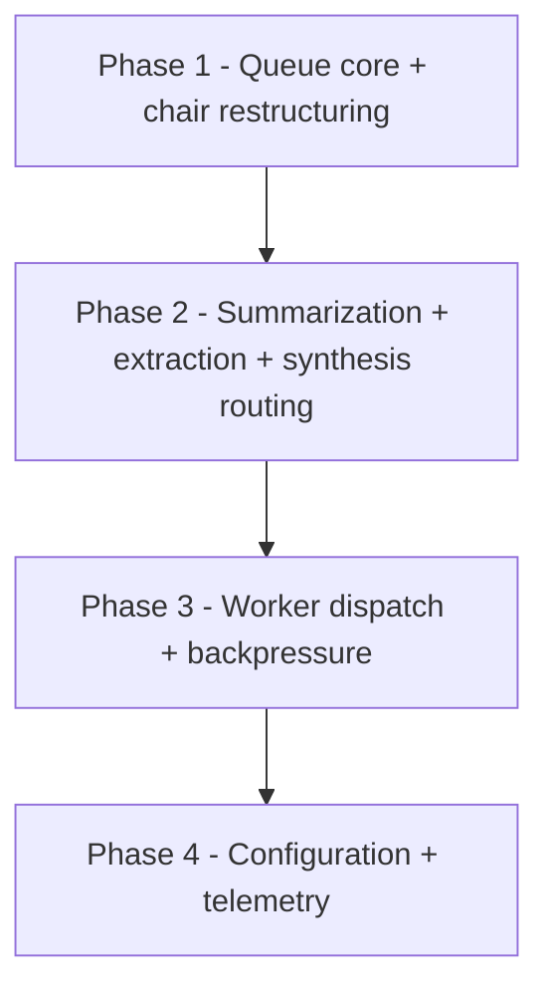

# commons-board — Inference Queuing Architecture

> **Status**: Design / discussion document. No code has been implemented.
> **Companion**: [`delegation-architecture.md`](commons-board/planning/delegation-architecture.md) — the chair → worker delegation flow this design protects.
> **Scope**: commons-board API service (`commons-board/services/api/`).

## Problem Statement

Every observed failure in the board chat flow traces back to the same root cause: **inference calls are made without coordination, without retry, and without backpressure.** The provider (featherless, OpenAI-compatible, model `zai-org/GLM-5.2`) has finite concurrent-call capacity and per-request time limits. The current code treats those limits as someone else's problem.

The concrete symptoms:

1. **Task extraction timeout** — [`extractDelegatableTasks()`](commons-board/services/api/src/services/task-extractor.ts:57) sends all 6 chair responses plus the full worker list as a single prompt. On featherless this times out because the prompt is too large for one inference call to complete within the provider's window.

2. **Over-extending inference lanes** — [`executeBoardChat()`](commons-board/services/api/src/routes/motherboard-chat.ts:58) fires all 6 chairs through [`mapConcurrent()`](commons-board/services/api/src/lib/model-client.ts:169) with `maxParallel` derived from the provider's lane count. When lanes ≥ 6, all chairs fire at once. Even when the concurrency gate holds, 6 simultaneous long-running reasoning calls saturate the key.

3. **No retry on timeout** — [`complete()`](commons-board/services/api/src/lib/model-client.ts:96) retries only on HTTP 429 (rate limit). A timeout (HTTP 504, AbortSignal timeout, or network error) fails the call permanently. Chair-5 got an HTTP 504 and was lost.

4. **No backpressure** — when the provider is overwhelmed, calls fail hard. There is no mechanism to slow down, queue, or shed load. A failed chair produces a degraded synthesis; a failed task extraction silently returns an empty array (workers never run).

5. **No prioritization** — chair deliberation, task extraction, worker dispatch, and synthesis all compete for the same lanes with no priority. A burst of worker calls can starve a synthesis call that the operator is waiting on.

## Design Goal

Introduce a **platform-wide inference queue** that sits between the call sites (`completeText`, `completeTextWithThinking`, `completeChat`) and the existing concurrency gate in [`complete()`](commons-board/services/api/src/lib/model-client.ts:96). The queue adds:

- **Per-call-type prioritization** — chair deliberation > task extraction > worker dispatch > synthesis.
- **Retry with exponential backoff** — on timeout and 5xx, not just 429.
- **Per-call-type timeout and concurrency budgets** — chairs get fewer concurrent slots but longer timeouts; workers get more slots but shorter timeouts.
- **Backpressure** — when the queue depth exceeds a threshold, new calls are queued (or shed for non-critical types) rather than fired immediately.
- **Per-chair inference calls** — each chair is a discrete, managed, retryable inference call rather than a member of a `Promise.all()` burst.

The design **extends** the existing concurrency gate in [`complete()`](commons-board/services/api/src/lib/model-client.ts:96) — it does not replace it. The gate already correctly keys on `provider_id` (not `workspaceId`), enforces `MIN_CALL_SPACING_MS` pacing, and retries on 429. The queue adds the layer above it: prioritization, retry-on-timeout, and per-type budgets.

## Current Inference Flow



### What exists today (the concurrency gate)

[`complete()`](commons-board/services/api/src/lib/model-client.ts:96) already implements a cross-caller concurrency gate:

- **Keyed by `provider_id`** — correct, since the same API key can be active for multiple workspaces.
- **`acquireProviderSlot()`** — bounds active calls to `maxParallel = floor(lanes / cost)`.
- **`MIN_CALL_SPACING_MS` (1500ms)** — enforces a minimum gap between consecutive slot grants, independent of concurrency.
- **429 backoff** — retries with `[2000, 4000, 8000, 16000]` ms delays.

### What the gate does NOT do

| Gap | Impact |
|-----|--------|
| No retry on timeout / 5xx | Chair-5's HTTP 504 was fatal. Task extraction timeout was fatal. |
| No prioritization | Worker calls compete with synthesis for the same slots. |
| No per-type concurrency budget | All call types share the same `maxParallel`. 6 chairs can saturate the key. |
| No per-type timeout | The provider's 240s `AbortSignal.timeout` is the only timeout, applied uniformly. |
| No backpressure / queue depth awareness | Calls fire as soon as a slot is free, even if the provider is degraded. |
| No call-type tagging | The gate has no idea whether a call is a chair, a worker, or synthesis. |

## Proposed Architecture



### Component: `InferenceQueue`

A new module at [`commons-board/services/api/src/lib/inference-queue.ts`](commons-board/services/api/src/lib/inference-queue.ts) (to be created).

The queue is a **priority-aware, retrying wrapper** around the existing [`complete()`](commons-board/services/api/src/lib/model-client.ts:96) function. It does not replace `complete()` — it calls it. The existing concurrency gate, pacing, and 429 backoff remain intact underneath.

#### Call types and priorities

```typescript
export type InferenceCallType =
  | "chair_deliberation"
  | "chair_summarize"    // new — per-chair summarization before task extraction
  | "task_extraction"
  | "worker_dispatch"
  | "board_synthesis";

export const CALL_TYPE_PRIORITY: Record<InferenceCallType, number> = {
  chair_deliberation: 0,   // highest — the operator is waiting on these
  chair_summarize: 1,      // runs after chairs, before extraction
  task_extraction: 2,      // depends on chair summaries
  board_synthesis: 3,      // the final aggregation the operator sees
  worker_dispatch: 4,      // lowest — workers can take longer, operator already has chair advice
};
```

Lower number = higher priority. When the queue has multiple calls waiting for a concurrency slot, the scheduler picks the highest-priority call first. Within the same priority, FIFO order is preserved.

#### Per-type configuration

```typescript
export interface CallTypeConfig {
  /** Max concurrent calls of this type. Independent of the provider's global maxParallel. */
  maxConcurrent: number;
  /** Per-call timeout in ms. Overrides the provider's 240s default. */
  timeoutMs: number;
  /** Retry attempts on timeout or 5xx. */
  maxRetries: number;
  /** Base delay for exponential backoff (ms). Actual delay = base * 2^attempt. */
  backoffBaseMs: number;
  /** Cap on backoff delay (ms). */
  backoffMaxMs: number;
}

export const DEFAULT_CALL_TYPE_CONFIG: Record<InferenceCallType, CallTypeConfig> = {
  chair_deliberation: {
    maxConcurrent: 2,      // 2-3 chairs at a time, not all 6
    timeoutMs: 180_000,    // 3 min — reasoning models need room
    maxRetries: 2,
    backoffBaseMs: 4000,
    backoffMaxMs: 30_000,
  },
  chair_summarize: {
    maxConcurrent: 3,      // summaries are short calls
    timeoutMs: 60_000,
    maxRetries: 2,
    backoffBaseMs: 3000,
    backoffMaxMs: 20_000,
  },
  task_extraction: {
    maxConcurrent: 1,      // one extraction at a time — it's a large call
    timeoutMs: 120_000,
    maxRetries: 2,
    backoffBaseMs: 4000,
    backoffMaxMs: 30_000,
  },
  worker_dispatch: {
    maxConcurrent: 3,      // workers can run in parallel but bounded
    timeoutMs: 120_000,
    maxRetries: 1,         // workers are lower priority — one retry
    backoffBaseMs: 5000,
    backoffMaxMs: 30_000,
  },
  board_synthesis: {
    maxConcurrent: 1,      // only one synthesis per board chat
    timeoutMs: 120_000,
    maxRetries: 2,
    backoffBaseMs: 4000,
    backoffMaxMs: 30_000,
  },
};
```

#### The enqueue API

```typescript
export interface InferenceCallRequest {
  workspaceId: string;
  system: string;
  prompt: string;
  options?: {
    max_tokens?: number;
    temperature?: number;
    correlation_id?: string;
    model?: string;
    history?: Array<{ role: "user" | "assistant"; content: string }>;
  };
  callType: InferenceCallType;
}

export interface InferenceCallResult {
  text: string;
  thinking: string;
  model: string;
  attempts: number;
  queuedForMs: number;
}

export async function enqueueInference(
  req: InferenceCallRequest
): Promise<InferenceCallResult>;
```

`enqueueInference()` is the single entry point. It:

1. Tags the call with its `callType` and priority.
2. Waits for a per-type concurrency slot (bounded by `maxConcurrent` for that type).
3. Waits for its turn in the priority scheduler (if other call types are also waiting).
4. Calls [`complete()`](commons-board/services/api/src/lib/model-client.ts:96) (which applies the existing global concurrency gate + pacing + 429 backoff).
5. On timeout or 5xx, retries with exponential backoff up to `maxRetries`.
6. Returns the result with telemetry (`attempts`, `queuedForMs`).

#### Retry logic

The existing 429 retry in [`complete()`](commons-board/services/api/src/lib/model-client.ts:96) stays. The queue adds retry for a broader set of failures:

```typescript
function shouldRetry(error: string | undefined, callType: InferenceCallType): boolean {
  if (!error) return false;
  // Timeout signals
  if (/timeout|timed out|abort/i.test(error)) return true;
  // Server errors
  if (/\b5\d\d\b/.test(error)) return true;
  // 429 is already retried inside complete(), but if it exhausts those retries,
  // the queue gives it one more shot at a higher level.
  if (/\b429\b/.test(error)) return true;
  return false;
}
```

Backoff is exponential with jitter:

```typescript
function backoffDelay(attempt: number, config: CallTypeConfig): number {
  const base = config.backoffBaseMs * Math.pow(2, attempt);
  const capped = Math.min(base, config.backoffMaxMs);
  const jitter = Math.random() * 0.3 * capped; // 0-30% jitter
  return capped + jitter;
}
```

#### Backpressure

When the total number of queued calls (across all types) exceeds `MAX_QUEUE_DEPTH` (default: 20), the queue applies backpressure:

- **Critical types** (`chair_deliberation`, `board_synthesis`): always enqueued, never shed.
- **Non-critical types** (`worker_dispatch`): if queue depth > `MAX_QUEUE_DEPTH`, new worker calls are immediately failed with a `QueueFullError` rather than enqueued. The dispatcher catches this and marks the task as `status: "skipped"` with `error: "inference queue at capacity"`.

This prevents a large task extraction (producing 10+ worker tasks) from flooding the queue and starving the synthesis call the operator is waiting on.

## Per-Chair Inference Restructuring

### Current behavior

[`executeBoardChat()`](commons-board/services/api/src/routes/motherboard-chat.ts:58) calls [`mapConcurrent()`](commons-board/services/api/src/lib/model-client.ts:169) with `maxParallel` from [`getProviderConcurrency()`](commons-board/services/api/src/lib/model-client.ts:152). When the provider has 6+ lanes, all 6 chairs fire simultaneously. Each chair calls [`completeTextWithThinking()`](commons-board/services/api/src/lib/model-client.ts:243), which goes through [`complete()`](commons-board/services/api/src/lib/model-client.ts:96).

The problem: 6 simultaneous reasoning-model calls on a single key saturate the provider. Even if the concurrency gate allows it, the provider's backend struggles with 6 long-running reasoning calls at once, leading to 504s and timeouts.

### Target behavior

Each chair is its own managed inference call, routed through the queue with `callType: "chair_deliberation"`. The queue's per-type budget (`maxConcurrent: 2`) ensures only 2 chairs run at a time. The remaining 4 chairs wait in the priority queue. As each chair completes, the next one is granted a slot.

### Changes to `motherboard-chat.ts`

Replace the `mapConcurrent()` call at [line 163](commons-board/services/api/src/routes/motherboard-chat.ts:163) with queue-routed calls:

```typescript
// BEFORE:
const { maxParallel } = getProviderConcurrency(workspaceId);
const chairResults = await mapConcurrent(activeChairs, maxParallel, async (chair) => {
  // ... buildReasonedBoardResponse ...
});

// AFTER:
const chairResults = await mapConcurrent(activeChairs, activeChairs.length, async (chair) => {
  // mapConcurrent with limit=activeChairs.length allows all chairs to enqueue
  // immediately, but the queue per-type budget maxConcurrent:2 controls actual
  // concurrency. Each chair inference call goes through enqueueInference.
  const result = await buildReasonedBoardResponse({
    workspaceId,
    request: syntheticRequest,
    roadmap: syntheticRoadmap,
    laborCommonsSlug,
    model: chair.model,
    callType: "chair_deliberation",  // NEW
  });
  // ... appendChairResult, return result ...
});
```

The `mapConcurrent` limit is set to `activeChairs.length` (all chairs enqueue immediately) because the queue — not `mapConcurrent` — controls actual concurrency. This preserves the progressive UI reveal: [`appendChairResult()`](commons-board/services/api/src/lib/board-chat-job-store.ts:94) is called as each chair completes, so the UI shows chairs appearing 2 at a time rather than all at once at the end.

### Changes to `chair-reasoning.ts`

[`buildReasonedBoardResponse()`](commons-board/services/api/src/services/chair-reasoning.ts:143) currently calls [`completeTextWithThinking()`](commons-board/services/api/src/lib/model-client.ts:243) directly. It needs to route through the queue instead:

```typescript
// BEFORE (line 212):
({ answer: responseText, thinking: responseThinking } = await completeTextWithThinking(
  input.workspaceId,
  systemPrompt,
  userParts.join("\n"),
  { temperature: 0.7, correlation_id: input.request.id, model: input.model }
));

// AFTER:
({ answer: responseText, thinking: responseThinking } = await enqueueInference({
  workspaceId: input.workspaceId,
  system: systemPrompt,
  prompt: userParts.join("\n"),
  options: { temperature: 0.7, correlation_id: input.request.id, model: input.model },
  callType: input.callType ?? "chair_deliberation",
}));
```

The `callType` parameter is added to `ReasoningInput` so callers can override it (e.g., for chair summarization, which uses the same function with a different call type).

### Why not just lower `maxParallel`?

Lowering `maxParallel` in the existing `mapConcurrent` call would reduce concurrency but would NOT add retry, timeout management, or backpressure. A chair that times out would still fail permanently. The queue adds all three. Additionally, `maxParallel` is derived from the provider's lane count — lowering it globally would also throttle worker dispatch and synthesis, which is not the intent. The per-type budget isolates chair concurrency from worker concurrency.

## Task Extraction Optimization

### Current behavior

[`extractDelegatableTasks()`](commons-board/services/api/src/services/task-extractor.ts:57) builds a single user prompt containing all 6 chair responses (full prose) plus the full worker list. This is sent as one [`completeText()`](commons-board/services/api/src/lib/model-client.ts:201) call. On featherless, this times out because the combined prompt is too large for the model to process within the provider's time window.

### Root cause

The prompt size is the problem, not the queue. Even with perfect queuing, a single call with 6 full chair responses (each potentially 1000+ words) plus a worker list is too large. The queue helps with retry, but the fix for the timeout is **reducing the prompt size**.

### Target behavior: summarize-then-extract

Introduce a **per-chair summarization** step between chair deliberation and task extraction. Each chair's full response is summarized into a compact form (key recommendations + actionable items, ~200 words) before being passed to the extractor. This reduces the extraction prompt from ~6000+ words to ~1500 words.



### New function: `summarizeChairResponse`

Added to [`chair-reasoning.ts`](commons-board/services/api/src/services/chair-reasoning.ts) or a new `chair-summarizer.ts`:

```typescript
export async function summarizeChairResponse(input: {
  workspaceId: string;
  chairId: string;
  chairName: string;
  domain: BoardDomain;
  responseText: string;
  model?: string;
}): Promise<string> {
  const system = [
    "You are a summarization system for a governing board.",
    "Summarize the chair response into actionable items and key recommendations.",
    "Keep it under 200 words. Focus on what could be delegated to a worker.",
    "Return plain text, no markdown headers.",
  ].join("\n");

  const result = await enqueueInference({
    workspaceId: input.workspaceId,
    system,
    prompt: input.responseText,
    options: { temperature: 0.1, max_tokens: 500, model: input.model },
    callType: "chair_summarize",
  });

  return result.text;
}
```

### Changes to `task-extractor.ts`

[`buildExtractorUserPrompt()`](commons-board/services/api/src/services/task-extractor.ts:136) currently uses `c.response_text` (full prose). It should use the summary instead:

```typescript
// BEFORE (line 137-143):
const chairSummaries = input.chairResponses
  .map((c) => {
    return [
      `--- Chair: ${c.chair_name} (id: ${c.chair_id}, domain: ${c.domain}) ---`,
      c.response_text,
    ].join("\n");
  })
  .join("\n\n");

// AFTER:
const chairSummaries = input.chairResponses
  .map((c) => {
    return [
      `--- Chair: ${c.chair_name} (id: ${c.chair_id}, domain: ${c.domain}) ---`,
      c.response_summary ?? c.response_text,  // fallback to full text if no summary
    ].join("\n");
  })
  .join("\n\n");
```

A new `response_summary?: string` field is added to [`DelegationChairResponse`](commons-board/services/api/src/services/delegation-types.ts:120).

### Changes to `motherboard-chat.ts`

After all chairs complete, summarize each one before passing to the extractor:

```typescript
// After chairResults is populated, before extractDelegatableTasks:
const chairResponses = await Promise.all(
  chairResults.map(async (r) => {
    let summary: string | undefined;
    try {
      summary = await summarizeChairResponse({
        workspaceId,
        chairId: r.chair.id,
        chairName: r.chair.name,
        domain: r.chair.domain,
        responseText: r.summary_markdown,
        model: synthesisModel,
      });
    } catch {
      // Summarization is non-blocking — fall back to full text.
    }
    return {
      chair_id: r.chair.id,
      chair_name: r.chair.name,
      domain: r.chair.domain,
      response_text: r.summary_markdown,
      response_summary: summary,
    };
  })
);
```

The summarization calls run through the queue with `callType: "chair_summarize"` (priority 1, `maxConcurrent: 3`). They can run in parallel since they are independent. The full chair responses are still passed to [`synthesizeBoardResponse()`](commons-board/services/api/src/services/board-synthesizer.ts:35) — only the extractor gets the summaries.

### Fallback

If summarization fails for a chair, the extractor falls back to the full response text (`response_summary ?? response_text`). If extraction itself fails, it returns an empty array (existing behavior) — workers do not run, synthesis proceeds with chair prose only.

## Worker Dispatch Queuing

### Current behavior

[`dispatchTasks()`](commons-board/services/api/src/services/delegation-dispatcher.ts:49) uses [`mapConcurrent()`](commons-board/services/api/src/lib/model-client.ts:169) with `maxParallel` from [`getProviderConcurrency()`](commons-board/services/api/src/lib/model-client.ts:152) to run tasks in waves. Each task calls [`completeText()`](commons-board/services/api/src/lib/model-client.ts:201) directly via [`executeTaskInline()`](commons-board/services/api/src/services/delegation-dispatcher.ts:168).

### Target behavior

Worker calls route through the queue with `callType: "worker_dispatch"` (priority 4, `maxConcurrent: 3`). The queue ensures:

1. Worker calls do not starve higher-priority calls (synthesis, chair deliberation).
2. Worker calls get retry on timeout (currently they fail permanently).
3. Backpressure: if the queue is full, new worker calls are shed (task marked `skipped`) rather than flooding the provider.

### Changes to `delegation-dispatcher.ts`

[`executeTaskInline()`](commons-board/services/api/src/services/delegation-dispatcher.ts:168) currently calls [`completeText()`](commons-board/services/api/src/lib/model-client.ts:201) directly. Route through the queue:

```typescript
// BEFORE (line 206-215):
const output = await withTimeout(
  completeText(workspaceId, systemPrompt, userMessage, {
    max_tokens: 4096,
    temperature: 0.2,
    correlation_id: job.job_id,
    model: agent?.model,
  }),
  timeoutMs,
  `task ${task.task_id} timed out after ${timeoutMs}ms`
);

// AFTER:
const result = await enqueueInference({
  workspaceId,
  system: systemPrompt,
  prompt: userMessage,
  options: {
    max_tokens: 4096,
    temperature: 0.2,
    correlation_id: job.job_id,
    model: agent?.model,
  },
  callType: "worker_dispatch",
});
const output = result.text;
```

The `withTimeout()` wrapper is removed — the queue's per-type `timeoutMs` handles this. The queue's retry logic replaces the current fail-on-first-error behavior.

### Backpressure handling

When the queue is at capacity, `enqueueInference()` throws a `QueueFullError`. The dispatcher catches this:

```typescript
try {
  const result = await enqueueInference({ /* ... */ });
  // success
} catch (err) {
  if (err instanceof QueueFullError) {
    return {
      // ... deliverable with status: skipped, error: inference queue at capacity
    };
  }
  throw err;
}
```

This is already the pattern in [`executeTaskInline()`](commons-board/services/api/src/services/delegation-dispatcher.ts:168) — it catches errors and returns a `failed` deliverable. The `QueueFullError` case returns `skipped` instead, signaling that the task could be retried later.

## Board Synthesis Queuing

### Current behavior

[`synthesizeBoardResponse()`](commons-board/services/api/src/services/board-synthesizer.ts:35) calls [`completeText()`](commons-board/services/api/src/lib/model-client.ts:201) directly at [line 114](commons-board/services/api/src/services/board-synthesizer.ts:114). It has no retry — on failure it falls back to a template synthesis (concatenating chair results). This means a transient timeout produces a degraded response even though a retry would have succeeded.

### Target behavior

Synthesis routes through the queue with `callType: "board_synthesis"` (priority 3, `maxConcurrent: 1`, `maxRetries: 2`). The queue's retry gives synthesis two chances to recover from a transient timeout before falling back to the template.

### Changes to `board-synthesizer.ts`

```typescript
// BEFORE (line 114):
const raw = await completeText(input.workspaceId, system, userPrompt, { model: input.model });

// AFTER:
const result = await enqueueInference({
  workspaceId: input.workspaceId,
  system,
  prompt: userPrompt,
  options: { model: input.model },
  callType: "board_synthesis",
});
const raw = result.text;
```

The existing fallback template synthesis (the `catch` block at [line 139](commons-board/services/api/src/services/board-synthesizer.ts:139)) remains as the last resort — it only fires if the queue exhausts all retries.

## Integration Points Summary

The table below maps every inference call site to its queue integration:

| Call site | File | Current function | Queue call type | Priority | Changes |
|-----------|------|------------------|-----------------|----------|---------|
| Chair deliberation | [`chair-reasoning.ts:212`](commons-board/services/api/src/services/chair-reasoning.ts:212) | `completeTextWithThinking()` | `chair_deliberation` | 0 | Route through `enqueueInference()`, add `callType` to `ReasoningInput` |
| Chair summarization | new `summarizeChairResponse()` | n/a | `chair_summarize` | 1 | New function, calls `enqueueInference()` |
| Task extraction | [`task-extractor.ts:74`](commons-board/services/api/src/services/task-extractor.ts:74) | `completeText()` | `task_extraction` | 2 | Route through `enqueueInference()`, use `response_summary` in prompt |
| Worker dispatch | [`delegation-dispatcher.ts:206`](commons-board/services/api/src/services/delegation-dispatcher.ts:206) | `completeText()` | `worker_dispatch` | 4 | Route through `enqueueInference()`, remove `withTimeout()`, catch `QueueFullError` |
| Board synthesis | [`board-synthesizer.ts:114`](commons-board/services/api/src/services/board-synthesizer.ts:114) | `completeText()` | `board_synthesis` | 3 | Route through `enqueueInference()` |

### Files to create

- [`commons-board/services/api/src/lib/inference-queue.ts`](commons-board/services/api/src/lib/inference-queue.ts) — `InferenceQueue`, `enqueueInference()`, `InferenceCallType`, `CallTypeConfig`, `QueueFullError`

### Files to modify

| File | Change |
|------|--------|
| [`chair-reasoning.ts`](commons-board/services/api/src/services/chair-reasoning.ts) | Add `callType` to `ReasoningInput`, replace `completeTextWithThinking()` with `enqueueInference()`, add `summarizeChairResponse()` |
| [`task-extractor.ts`](commons-board/services/api/src/services/task-extractor.ts) | Replace `completeText()` with `enqueueInference()` at `callType: "task_extraction"`, use `response_summary` in prompt |
| [`delegation-dispatcher.ts`](commons-board/services/api/src/services/delegation-dispatcher.ts) | Replace `completeText()` with `enqueueInference()` at `callType: "worker_dispatch"`, remove `withTimeout()`, catch `QueueFullError` |
| [`board-synthesizer.ts`](commons-board/services/api/src/services/board-synthesizer.ts) | Replace `completeText()` with `enqueueInference()` at `callType: "board_synthesis"` |
| [`motherboard-chat.ts`](commons-board/services/api/src/routes/motherboard-chat.ts) | Change `mapConcurrent` limit to `activeChairs.length`, add summarization step before extraction, pass `callType` to `buildReasonedBoardResponse` |
| [`delegation-types.ts`](commons-board/services/api/src/services/delegation-types.ts) | Add `response_summary?: string` to `DelegationChairResponse` |

### What does NOT change

- [`complete()`](commons-board/services/api/src/lib/model-client.ts:96) — the existing concurrency gate, pacing, and 429 backoff remain intact. The queue calls `complete()` underneath.
- [`hosted-api.ts`](commons-board/services/api/src/lib/provider/hosted-api.ts) — the provider adapter is unchanged. The 240s `AbortSignal.timeout` remains as the hard floor; the queue's per-type `timeoutMs` can be shorter but not longer.
- [`getProviderConcurrency()`](commons-board/services/api/src/lib/model-client.ts:152) — still used by the dispatcher for topological wave sizing, but actual concurrency is now bounded by the queue's per-type budget.
- [`mapConcurrent()`](commons-board/services/api/src/lib/model-client.ts:169) — still used, but its `limit` parameter no longer controls inference concurrency (the queue does). It controls how many calls are initiated (enqueued) at once.

## Configuration

### Workspace-level configuration

The per-type config defaults are defined in code (see `DEFAULT_CALL_TYPE_CONFIG` above). They can be overridden via workspace settings:

```typescript
// In WorkspaceSettings (shared types):
export interface InferenceQueueSettings {
  /** Override per-type concurrency, timeout, and retry settings. */
  call_type_overrides?: Partial<Record<InferenceCallType, Partial<CallTypeConfig>>>;
  /** Max total queued calls before backpressure kicks in. Default: 20. */
  max_queue_depth?: number;
  /** Enable queue telemetry logging. Default: false. */
  enable_telemetry?: boolean;
}
```

This lives in `WorkspaceSettings.inference_queue` and is read at enqueue time (same pattern as the existing provider config read in [`loadSettings()`](commons-board/services/api/src/lib/model-client.ts:16)).

### Environment-level configuration

For deployment-wide defaults (e.g., a self-hosted instance with a beefier provider):

```bash
# Override the global queue depth limit
CB_INFERENCE_MAX_QUEUE_DEPTH=40

# Override chair deliberation concurrency
CB_INFERENCE_CHAIR_MAX_CONCURRENT=3

# Override worker dispatch timeout
CB_INFERENCE_WORKER_TIMEOUT_MS=90000
```

Env vars override code defaults but are overridden by workspace settings. This follows the existing pattern in [`env.ts`](commons-board/services/api/src/lib/env.ts).

### Telemetry

When `enable_telemetry` is true, the queue logs each call:

```json
{
  "event": "inference_call",
  "call_type": "chair_deliberation",
  "workspace_id": "ws_abc",
  "attempts": 1,
  "queued_for_ms": 4200,
  "total_ms": 38000,
  "status": "ok",
  "correlation_id": "req_123"
}
```

This is written to the console (existing pattern) and can be aggregated for monitoring. It does NOT go into the decision log — inference telemetry is operational, not governance.

## Phased Implementation Plan

### Phase 1 — Inference queue core + chair restructuring

**Goal**: Build the queue, route chair deliberation through it, fix the over-extension problem.

**Files to create**:
- [`inference-queue.ts`](commons-board/services/api/src/lib/inference-queue.ts) — `enqueueInference()`, `InferenceCallType`, `CallTypeConfig`, `DEFAULT_CALL_TYPE_CONFIG`, `QueueFullError`, priority scheduler, per-type concurrency budget, retry with backoff

**Files to modify**:
- [`chair-reasoning.ts`](commons-board/services/api/src/services/chair-reasoning.ts) — Add `callType` to `ReasoningInput`, replace `completeTextWithThinking()` with `enqueueInference()`
- [`motherboard-chat.ts`](commons-board/services/api/src/routes/motherboard-chat.ts) — Change `mapConcurrent` limit to `activeChairs.length`, pass `callType: "chair_deliberation"` to `buildReasonedBoardResponse`

**Verification**:
- Send a board chat message that triggers all 6 chairs. Confirm via logs that only 2 chairs run concurrently (per-type budget), and that chairs complete progressively (UI shows them appearing 2 at a time).
- Simulate a chair timeout (e.g., point one chair at an invalid model). Confirm the queue retries it twice before failing, and the failure is caught by the existing `catch` block in `executeBoardChat`.
- Confirm existing prose-only flow still works when no provider is configured (`NoProviderConfiguredError` propagates correctly through the queue).

**Out of scope for Phase 1**: summarization, task extraction routing, worker dispatch routing, synthesis routing, backpressure shedding.

### Phase 2 — Task extraction optimization + all call types routed

**Goal**: Add chair summarization, route task extraction and synthesis through the queue, fix the extraction timeout.

**Files to modify**:
- [`chair-reasoning.ts`](commons-board/services/api/src/services/chair-reasoning.ts) — Add `summarizeChairResponse()` function
- [`task-extractor.ts`](commons-board/services/api/src/services/task-extractor.ts) — Replace `completeText()` with `enqueueInference()` at `callType: "task_extraction"`, use `response_summary` in prompt
- [`board-synthesizer.ts`](commons-board/services/api/src/services/board-synthesizer.ts) — Replace `completeText()` with `enqueueInference()` at `callType: "board_synthesis"`
- [`motherboard-chat.ts`](commons-board/services/api/src/routes/motherboard-chat.ts) — Add summarization step before extraction, pass `response_summary` to extractor
- [`delegation-types.ts`](commons-board/services/api/src/services/delegation-types.ts) — Add `response_summary?: string` to `DelegationChairResponse`

**Verification**:
- Send a board chat message that previously timed out on task extraction. Confirm the summarization step runs (6 short calls, 3 concurrent), then extraction succeeds with the compact prompt.
- Confirm task extraction still works when summarization fails for a chair (falls back to full text).
- Confirm synthesis retries on timeout before falling back to template.

**Out of scope for Phase 2**: worker dispatch routing, backpressure shedding.

### Phase 3 — Worker dispatch routing + backpressure

**Goal**: Route worker calls through the queue, add backpressure shedding.

**Files to modify**:
- [`delegation-dispatcher.ts`](commons-board/services/api/src/services/delegation-dispatcher.ts) — Replace `completeText()` with `enqueueInference()` at `callType: "worker_dispatch"`, remove `withTimeout()`, catch `QueueFullError`
- [`inference-queue.ts`](commons-board/services/api/src/lib/inference-queue.ts) — Implement backpressure shedding for non-critical types when queue depth exceeds `MAX_QUEUE_DEPTH`

**Verification**:
- Send a board chat message that extracts 10+ tasks. Confirm worker calls run 3 at a time (per-type budget), and that if the queue fills, excess tasks are marked `skipped` with `error: "inference queue at capacity"` rather than flooding the provider.
- Confirm worker calls retry on timeout (previously failed permanently).
- Confirm a large worker batch does not starve a subsequent synthesis call (priority scheduling).

### Phase 4 — Configuration + telemetry

**Goal**: Make settings configurable, add telemetry.

**Files to modify**:
- [`inference-queue.ts`](commons-board/services/api/src/lib/inference-queue.ts) — Read `InferenceQueueSettings` from workspace settings, apply overrides, emit telemetry events
- Shared types — Add `InferenceQueueSettings` to `WorkspaceSettings`
- [`env.ts`](commons-board/services/api/src/lib/env.ts) — Add `CB_INFERENCE_*` env var support

**Verification**:
- Override `chair_deliberation.maxConcurrent` to 3 via workspace settings. Confirm 3 chairs run concurrently.
- Enable telemetry. Confirm `inference_call` events are logged with correct `attempts`, `queued_for_ms`, and `status`.

### Dependency graph



Phase 1 is independently shippable and fixes the most visible problem (all 6 chairs firing at once). Phase 2 fixes the task extraction timeout. Phase 3 adds worker backpressure. Phase 4 makes it tunable.

## How This Resolves the Observed Issues

| Issue | Resolution |
|-------|------------|
| Task extraction timeout | Phase 2: summarize-then-extract reduces prompt from ~6000 to ~1500 words. Queue retry gives extraction 2 attempts. |
| Over-extending inference lanes | Phase 1: per-type budget limits chairs to 2 concurrent. Queue controls actual concurrency, not `mapConcurrent`. |
| Each chair should be its own call | Phase 1: each chair is a discrete `enqueueInference()` call with its own retry, timeout, and queue slot. |
| No queuing or backpressure | Phase 1+3: priority queue with per-type budgets. Phase 3 adds backpressure shedding for workers. |
| No retry logic | Phase 1: exponential backoff with jitter on timeout and 5xx. Existing 429 retry in `complete()` remains underneath. |
| Chair-5 HTTP 504 | Phase 1: queue retries the 504 twice with backoff before failing. The failure is caught by the existing `catch` block, so the board chat continues with 5 chairs instead of crashing. |