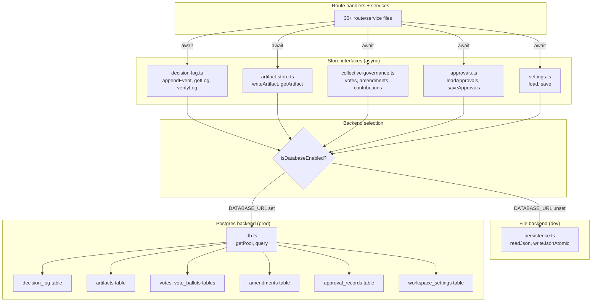

# Persistence Backend Split — Wire Decision Log + Governance Stores to Postgres

## Problem Statement

The project ships 6 PostgreSQL migrations (28 tables) but **all** route handlers and lib modules read/write via the file-backed JSON store ([`persistence.ts`](../services/api/src/lib/persistence.ts:30)). [`db.ts`](../services/api/src/lib/db.ts:12) exports `isDatabaseEnabled()` / `getPool()` / `query()`, but the **only** caller is [`db-migrate.ts`](../services/api/src/lib/db-migrate.ts:10) — the migration runner itself. [`docker-compose.yml`](../docker-compose.yml:25) sets `DATABASE_URL` and runs Postgres, but the API holds zero connections to it. Postgres is running but completely unused.

The code comments in [`decision-log.ts:8`](../services/api/src/lib/decision-log.ts:8) and [`collective-governance.ts:13`](../services/api/src/lib/collective-governance.ts:13) explicitly state the intended design: file-backed for dev, Postgres "behind this same interface" for production. This plan closes that gap.

## Scope

**In scope:** Wire the governance-critical stores to Postgres when `DATABASE_URL` is set, falling back to the file-backed store when it is not. The stores in scope are the ones with existing migrations and explicit "Postgres backend" intent:

1. **Decision log** — [`decision-log.ts`](../services/api/src/lib/decision-log.ts:34) → `decision_log` table (migration 0001)
2. **Approvals** — [`approvals.ts`](../services/api/src/routes/approvals.ts:28) → `approval_records` table (migration 0001)
3. **Collective governance** (votes, ballots, amendments, contributions) — [`collective-governance.ts`](../services/api/src/lib/collective-governance.ts:74) → `votes`, `vote_ballots`, `amendments`, `contributions` tables (migration 0002)
4. **Artifacts** — [`artifact-store.ts`](../services/api/src/lib/artifact-store.ts:30) → `artifacts` table (migration 0001)
5. **Workspace settings** — [`settings.ts`](../services/api/src/routes/settings.ts:37) → `workspace_settings` table (migration 0005)

**Out of scope (deferred — no existing migration-backed store module, or lower governance criticality):**
- `board-chat-job-store.ts`, `ai-chat-session-store.ts`, `job-store.ts` — runtime operational state, not governance-critical; migration 0006 has tables but these are operational caches
- `webhook-delivery.ts`, `labor-commons-client.ts`, `model-client.ts`, `inference-queue.ts` — read-only config caches, not governance state
- `board-session-state.ts`, `operational-loop.ts` — ephemeral session state
- The runtime-ops tables from migration 0006 (`action_requests`, `action_ledger`, `board_meetings`, `dead_letters`, etc.) — these back route handlers that currently use ad-hoc persistence keys; wiring them is a separate, larger effort

## Key Design Constraint: Sync → Async

All current store functions are **synchronous** (`appendEvent()`, `getLog()`, `writeArtifact()`, `loadApprovals()`, etc.). Postgres I/O is **asynchronous**. Wiring to Postgres forces an async migration of the store interfaces.

This is the single largest ripple in the plan. `appendEvent()` alone is called from ~30 files. Every caller must become `async` and `await` the call. The alternative — a synchronous bridge that blocks the event loop on DB I/O — is unacceptable for a production API.

**Decision:** Migrate the store interfaces to async. Accept the ripple. This is the correct design and matches the stated intent in the code comments.

## Architecture

## Implementation Phases

### Phase 1 — Decision log to Postgres (highest governance criticality)

The decision log is the append-only, hash-chained audit trail. It is the most governance-critical store and the one with the most callers (~30 files via `appendEvent`).

**Files to modify:**
- [`decision-log.ts`](../services/api/src/lib/decision-log.ts:34) — make `appendEvent()`, `getLog()`, `verifyLog()` async; add Postgres backend behind `isDatabaseEnabled()` check
- **~30 caller files** — add `await` to every `appendEvent(...)` call. These are all in `routes/` and `lib/` (see search results for the full list)

**Postgres mapping** (migration 0001, `decision_log` table):
| TS field | SQL column | Type |
|----------|-----------|------|
| `entry_id` | `entry_id` | UUID PK |
| `org_id` | `org_id` | TEXT FK → orgs |
| `sequence` | `sequence` | INTEGER (UNIQUE per org) |
| `event` | `event` | JSONB |
| `signed` | `signed` | JSONB |
| `previous_hash` | `previous_hash` | TEXT |
| `entry_hash` | `entry_hash` | TEXT |
| `at` | `at` | TIMESTAMPTZ |

**Hash-chain integrity in Postgres:** The current `sequence` is `log.length` (0-indexed). In Postgres, use `SELECT COALESCE(MAX(sequence), -1) + 1 FROM decision_log WHERE org_id = $1` to get the next sequence. The `previous_hash` comes from `SELECT entry_hash FROM decision_log WHERE org_id = $1 ORDER BY sequence DESC LIMIT 1`. The hash computation itself is unchanged (SHA-256 over the entry minus `entry_hash`).

**Critical invariant:** `appendEvent()` must be atomic — the sequence assignment, hash computation, and insert must happen in a single transaction to prevent sequence gaps or hash-chain breaks under concurrent appends. Use `BEGIN; SELECT MAX(sequence)...; INSERT...; COMMIT;` in a single `client = pool.connect()` block.

**`orgs` table prerequisite:** The `decision_log` table has `org_id TEXT NOT NULL REFERENCES orgs(id)`. The file-backed store has no such constraint. Either (a) ensure every workspace that appends events has a corresponding `orgs` row, or (b) add a migration that drops the FK constraint. **Recommendation:** add an `ensureOrg()` helper that does `INSERT INTO orgs (id, org_name, governance_mode) VALUES ($1, $1, 'business') ON CONFLICT (id) DO NOTHING` before the first event append for an org. This is idempotent and safe.

### Phase 2 — Artifact store to Postgres

[`artifact-store.ts`](../services/api/src/lib/artifact-store.ts:45) — `writeArtifact()`, `getArtifact()`, `getArtifactHistory()`.

**Postgres mapping** (migration 0001, `artifacts` table):
| TS field | SQL column | Type |
|----------|-----------|------|
| `artifact_id` | `artifact_id` | UUID PK (gen_random_uuid) |
| `org_id` | `org_id` | TEXT FK → orgs |
| `type` | `type` | TEXT |
| `version` | `version` | INTEGER |
| `payload` | `payload` | JSONB |
| `created_at` | `created_at` | TIMESTAMPTZ |

The `UNIQUE (org_id, type, version)` constraint enforces version monotonicity. `version` assignment: `SELECT COALESCE(MAX(version), 0) + 1 FROM artifacts WHERE org_id = $1 AND type = $2`.

**Callers:** `writeArtifact` / `getArtifact` are called from ~15 route files. All must become async/await.

**Note:** `writeArtifact()` calls `appendEvent()` (governance-first invariant). Both become async. The governance event must be appended **before** the artifact insert is committed. If using Postgres for both, this should be a single transaction: append event + insert artifact in one `BEGIN/COMMIT`. If the file backend is in use for one and Postgres for the other (shouldn't happen — they're both gated on `isDatabaseEnabled()`), the ordering still holds but atomicity is best-effort.

### Phase 3 — Approvals to Postgres

[`approvals.ts`](../services/api/src/routes/approvals.ts:28) — `loadApprovals()`, `saveApprovals()`.

**Postgres mapping** (migration 0001, `approval_records` table):
| TS field | SQL column | Type |
|----------|-----------|------|
| `approval_id` | `approval_id` | UUID PK |
| `org_id` | `org_id` | TEXT FK → orgs |
| `action_id` | `action_id` | TEXT |
| `status` | `status` | TEXT CHECK |
| `required_approvers` | `required_approvers` | INTEGER |
| `responses` | `responses` | JSONB |
| `created_at` | `created_at` | TIMESTAMPTZ |
| `resolved_at` | `resolved_at` | TIMESTAMPTZ |

**Schema gap:** The `ApprovalRecord` TS type has `action_type`, `summary`, `risk_score`, `blast_radius` fields that are **not** in the migration's `approval_records` table. **Decision (confirmed with user):** add migration `0007_approval_extensions.sql` with explicit columns for each missing field — queryable, typed, follows the existing migration pattern.

**Current pattern:** `loadApprovals()` reads the whole array, `saveApprovals()` writes the whole array. In Postgres, switch to row-level operations: `INSERT` for create, `UPDATE` for approve/reject. This is more efficient and avoids read-modify-write races.

### Phase 4 — Collective governance to Postgres

[`collective-governance.ts`](../services/api/src/lib/collective-governance.ts:74) — votes, ballots, amendments, contributions.

**Postgres mapping** (migration 0002):
- `votes` table ← `VoteRecord`
- `vote_ballots` table ← `BallotRecord`
- `amendments` table ← `AmendmentRecord`
- `contributions` table ← `ContributionRecord`

All four stores use the load-all/modify/save-all pattern. In Postgres, switch to row-level INSERT/UPDATE. The `UNIQUE (vote_id, member_id)` constraint on `vote_ballots` enforces one-ballot-per-member-per-vote at the DB level (currently enforced in application code).

**Schema gap:** `VoteRecord` has `supermajority_threshold` and `quorum_threshold` fields not in the `votes` table. **Decision (confirmed with user):** add migration `0008_vote_thresholds.sql` with explicit `supermajority_threshold` and `quorum_threshold` columns. The `tally` column stays as vote counts only.

### Phase 5 — Workspace settings to Postgres

[`settings.ts`](../services/api/src/routes/settings.ts:37) — `load()`, `save()`.

**Postgres mapping** (migration 0005, `workspace_settings` table):
| TS field | SQL column | Type |
|----------|-----------|------|
| `workspace_id` | `workspace_id` | TEXT PK |
| `active_provider_id` | `active_provider_id` | TEXT |
| `providers` | `providers` | JSONB |
| `rbac` | `rbac` | JSONB |
| `feature_toggles` | `feature_toggles` | JSONB |
| `updated_at` | `updated_at` | TIMESTAMPTZ |

**Schema gap:** The `WorkspaceSettings` TS type has `org_name`, `governance_mode`, `board_settings`, `addin_catalog_url`, `inference_queue` fields not in the migration. **Decision (confirmed with user):** add migration `0009_settings_extensions.sql` with explicit columns for each field. `board_settings` and `inference_queue` are JSONB (they're nested objects); the rest are TEXT/BOOLEAN.

### Phase 6 — Backfill script

Once the Postgres backends are wired, existing file-backed JSON data must be migrated to Postgres for any workspace that has accumulated state.

**New file:** `services/api/src/lib/db-backfill.ts`

Reads each JSON file from `CB_DATA_DIR`, maps to the corresponding table, and inserts. Idempotent (use `ON CONFLICT DO NOTHING` or check existence first). Run as: `node --import tsx src/lib/db-backfill.ts`.

**Tables to backfill:**
- `decision-log/*.json` → `decision_log`
- `artifacts/*/*.json` → `artifacts`
- `approvals/*.json` → `approval_records`
- `votes/*.json` → `votes`
- `vote-ballots/*.json` → `vote_ballots`
- `amendments/*.json` → `amendments`
- `contributions/*.json` → `contributions`
- `settings/*.json` → `workspace_settings`

**Hash-chain preservation:** The decision log backfill must preserve `sequence`, `previous_hash`, and `entry_hash` exactly as they are in the JSON — do not recompute. Insert in sequence order.

### Phase 7 — Run migrations against live Postgres + verify

- Run `npm run migrate -w @commons-board/api` against the compose Postgres
- Run the backfill script
- Verify: `GET /api/v1/decision-log` returns entries from Postgres, not JSON files
- Verify: `GET /api/v1/decision-log/verify` confirms chain integrity in Postgres
- Verify: write a new artifact, confirm it appears in `artifacts` table
- Verify: with `DATABASE_URL` unset, all stores fall back to file-backed (dev mode unbroken)

## Testing Strategy

- **Unit tests:** The existing tests in `__tests__/` use the file-backed store via `createTestDataDir()`. These must continue to pass (they run with `DATABASE_URL` unset). Add parallel tests that set `DATABASE_URL` to a test Postgres instance and verify the Postgres code paths.
- **Integration tests (confirmed with user: testcontainers):** Add tests that run against a real Postgres spun up via `testcontainers` covering: append → read → verify chain; artifact write → governance event → read; vote lifecycle; approval lifecycle. Add `testcontainers` as a devDependency. The test harness starts a Postgres container, runs migrations, sets `DATABASE_URL`, and tears down after.
- **Reachability check (OLF verification rule 1):** After implementation, verify that `GET /api/v1/decision-log` actually hits Postgres by checking `pg_stat_activity` for active queries during the request, and by confirming data written via the API appears in the `decision_log` table via `psql`.

## Risk Assessment

1. **Async ripple is large.** ~30 files call `appendEvent()`. Every one needs `await`. Missing one silently drops the governance event (the call returns a Promise that's never awaited, the event may not be persisted before the response). **Mitigation:** The tsconfig has `"strict": true` but does **NOT** enable `no-floating-promises` (confirmed by reading [`tsconfig.base.json`](../tsconfig.base.json:1)) — the compiler will **not** catch un-awaited Promises. Two options: (a) add `"noUncheckedIndexedAccess"` to tsconfig (insufficient — doesn't catch floating promises), or (b) add the `@typescript-eslint/no-floating-promises` lint rule. **Recommendation:** add the lint rule as a devDependency and run it as a gate after the async migration. Additionally, do a manual grep audit for `appendEvent(` without preceding `await` before marking any phase done.

2. **Hash-chain integrity under concurrency.** The file-backed store is single-process, so sequence assignment is race-free. Postgres is multi-connection. **Mitigation:** Use `SELECT ... FOR UPDATE` or a single-transaction sequence assignment as described in Phase 1.

3. **Schema drift.** The TS types have fields not in the migrations. **Mitigation:** Add extension migrations 0007-0009 with explicit columns (confirmed with user).

4. **`orgs` FK constraint.** The file-backed store has no orgs table; appending an event for an org that doesn't exist in `orgs` will fail the FK. **Mitigation:** `ensureOrg()` upsert before first event.

5. **Hidden synchronous callers of store functions.** Some store functions are called from synchronous contexts that cannot easily become async. Confirmed example: [`workspace.ts:241`](../services/api/src/routes/workspace.ts:241) exports `isWorkspaceKillSwitchEnabled()` — a synchronous function that reads from persistence. If workspace ops ever moves to Postgres, this synchronous caller breaks. **Mitigation:** Before migrating any store to async, grep for all callers (not just route handlers) and identify synchronous callers. For workspace ops specifically, keep it on the file-backed store (it's operational state, not governance state — already out of scope).

6. **Route handlers that are currently synchronous.** Many route handlers (e.g. [`approvals.ts`](../services/api/src/routes/approvals.ts:36), [`settings.ts`](../services/api/src/routes/settings.ts:75)) are synchronous `(req, res) => { ... }`. When their store calls become async, the handler must become `async (req, res) => { ... }`. Express handles async handlers fine, but unhandled rejections in async handlers are **not** caught by the error middleware — they need `try/catch` or a wrapper. **Mitigation:** Audit each route handler that becomes async; either add `try/catch` with `next(err)` or use an `asyncHandler` wrapper.

## Resolved Scope Decisions

1. **Schema gaps:** Add extension migrations 0007-0009 with explicit columns for each missing field (confirmed with user).
2. **Backfill scope:** Backfill all 8 stores (confirmed with user).
3. **Testing:** Use `testcontainers` to spin up a test Postgres for integration tests (confirmed with user).

## Repo Maintenance Workflow (Extended Dev Cycle)

This is a large, multi-phase change. To keep the working branch clean and reviewable, each phase gets its own commit, and logical groups of phases get PRs.

### Branch strategy

- **Working branch:** `feat/persistence-backend-split` (cut from `main`)
- **Commit cadence:** one commit per phase (or sub-phase for Phase 1, which is the largest). Each commit must pass `npm run typecheck` and `npm run test` before being committed.
- **PR cadence:** three PRs, each covering a reviewable slice:
  - **PR 1 — Schema + decision log:** Phase 0 (extension migrations) + Phase 1 (decision log to Postgres). This is the highest-risk PR (async migration of `appendEvent` + ~30 callers). Independent review by a fresh agent (OLF verification rule 1) before merge.
  - **PR 2 — Remaining stores:** Phases 2-5 (artifacts, approvals, collective governance, settings). These follow the pattern established in PR 1.
  - **PR 3 — Backfill + tests + verification:** Phases 6-8 (backfill script, testcontainers tests, live Postgres verification).

### Per-phase commit checklist

Before committing any phase:
1. `npm run typecheck -w @commons-board/api` passes clean
2. `npm run test -w @commons-board/api` passes (file-backed tests still green)
3. `npm run lint` passes (if lint script exists; if not, skip)
4. Grep audit: no un-awaited `appendEvent(` / `writeArtifact(` / `getArtifact(` calls introduced by this phase
5. Commit message format: `feat(persistence): phase N — <short description>`

### PR merge gates

Before merging any PR:
1. All phase commits in the PR pass typecheck + test
2. Independent review by a fresh Ask-mode agent with no builder context (OLF verification rule 1) — give it the original ask verbatim plus the diff
3. Reachability check: the new Postgres code path is actually reachable from a real API endpoint (grep the route, confirm the route is mounted in [`index.ts`](../services/api/src/index.ts:71), confirm the handler calls the async store function)
4. Merge via squash to keep `main` history clean

### GitHub App bot policy

Per `.clinerules`: Roo must NOT use the `jkmurphy-alt` personal account for repo operations. All PRs, reviews, and merges must go through one of the three GitHub App bot accounts (`olf-steward` for commons-board). **Current gap:** none of the three Apps are configured locally. Before the first PR, either:
- (a) Configure the `olf-steward` App locally (set `GITHUB_APP_*` env vars, mint a token via `node commons-keeper/src/print-app-token.mjs`), or
- (b) Ask the user to handle PR creation/merge manually via their own `gh` CLI session.

**Recommendation:** ask the user before the first PR. Do not fall back to `jkmurphy-alt`.

### Resolved implementation decisions

1. **`no-floating-promises` lint rule (confirmed with user):** Add `@typescript-eslint/no-floating-promises` as a devDependency and lint gate. This is the safest option — it catches un-awaited Promises automatically, which is critical for governance events. Add it before Phase 1.

2. **Express async handler wrapper (confirmed with user):** Add an `asyncHandler` wrapper (standard pattern: `(fn) => (req, res, next) => Promise.resolve(fn(req, res, next)).catch(next)`). Cleaner and less error-prone than `try/catch` in every handler. Add it to a new `lib/async-handler.ts` before Phase 1.

3. **GitHub App configuration (confirmed with user):** Configure the `olf-steward` App locally before the first PR. Set `GITHUB_APP_*` env vars and mint a bot token via `node commons-keeper/src/print-app-token.mjs`, then use `gh` CLI with that bot token in `GH_TOKEN`. Roo must NOT fall back to `jkmurphy-alt`.

4. **Phase 1 sub-phasing (confirmed with user):** Single commit for Phase 1. The async migration and all ~30 caller updates must land together to keep the branch green — splitting would leave the branch in a broken state between sub-commits.